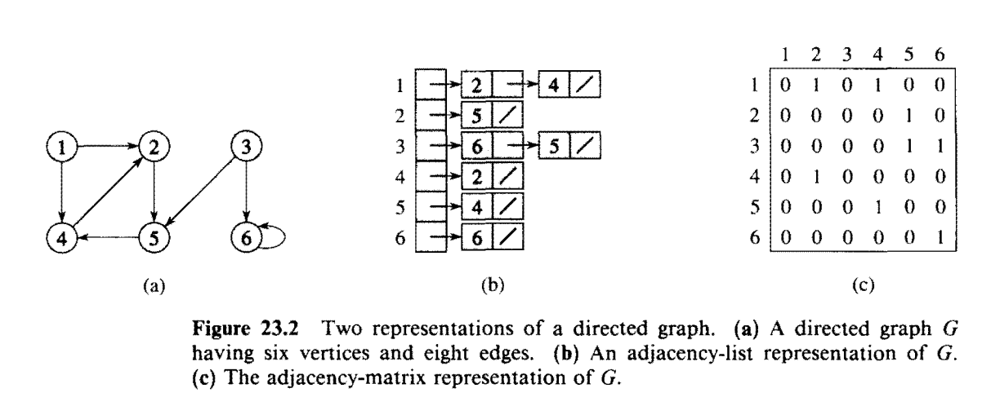
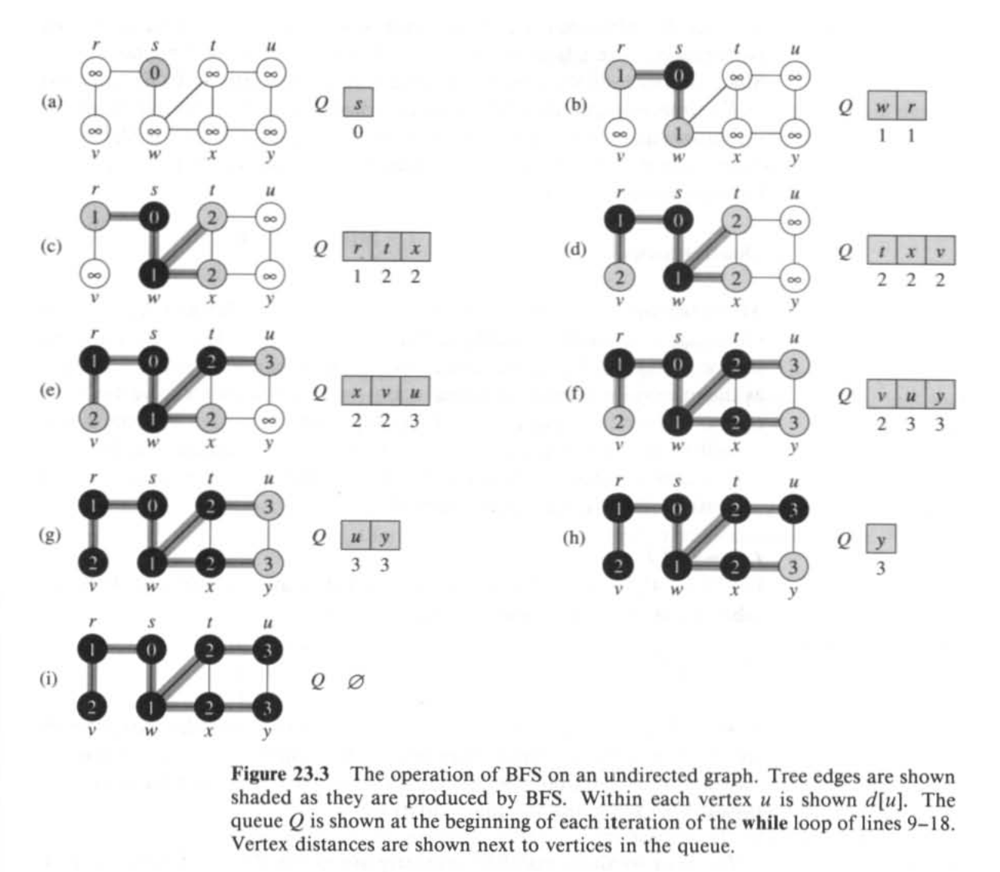
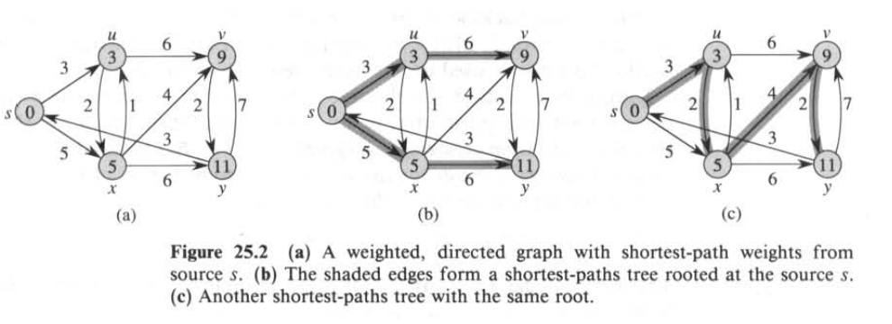
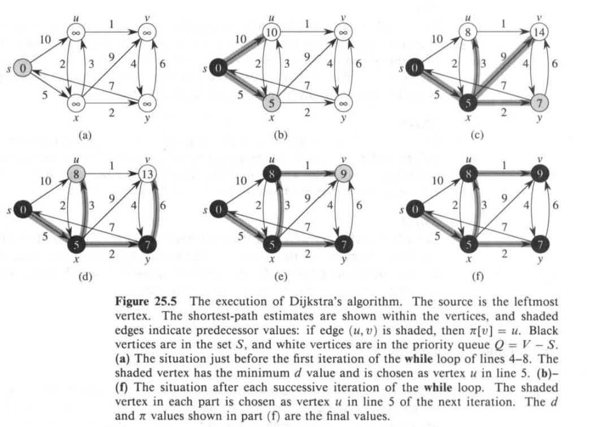

---
jupytext:
  formats: ipynb,md:myst
  text_representation:
    extension: .md
    format_name: myst
    format_version: 0.13
    jupytext_version: 1.17.3
kernelspec:
  display_name: Python 3 (ipykernel)
  language: python
  name: python3
---

+++ {"id": "2541b5d3", "slideshow": {"slide_type": ""}}

# HW2: BFS, Dijkstra And PriorityQueue

[Open in MyBinder.org](https://mybinder.org/v2/gh/wecacuee/ECE417-F25-Mobile-Robots/HEAD?urlpath=%2Fdoc%2Ftree%2Fhw%2F01-1901-discrete-planning%2Fstudent%2FHW2_BFSDijkstraAndPriorityQueue.ipynb)

+++ {"editable": true, "id": "cec19777", "slideshow": {"slide_type": ""}}

$$
\newcommand{\calA}{{\cal A}}
\newcommand{\calB}{{\cal B}}
\newcommand{\calC}{{\cal C}}
\newcommand{\calD}{{\cal D}}
\newcommand{\calE}{{\cal E}}
\newcommand{\calF}{{\cal F}}
\newcommand{\calG}{{\cal G}}
\newcommand{\calH}{{\cal H}}
\newcommand{\calI}{{\cal I}}
\newcommand{\calJ}{{\cal J}}
\newcommand{\calK}{{\cal K}}
\newcommand{\calL}{{\cal L}}
\newcommand{\calM}{{\cal M}}
\newcommand{\calN}{{\cal N}}
\newcommand{\calO}{{\cal O}}
\newcommand{\calP}{{\cal P}}
\newcommand{\calQ}{{\cal Q}}
\newcommand{\calR}{{\cal R}}
\newcommand{\calS}{{\cal S}}
\newcommand{\calT}{{\cal T}}
\newcommand{\calU}{{\cal U}}
\newcommand{\calV}{{\cal V}}
\newcommand{\calW}{{\cal W}}
\newcommand{\calX}{{\cal X}}
\newcommand{\calY}{{\cal Y}}
\newcommand{\calZ}{{\cal Z}}
%
% Sets:
\newcommand{\setA}{\textsf{A}}
\newcommand{\setB}{\textsf{B}}
\newcommand{\setC}{\textsf{C}}
\newcommand{\setD}{\textsf{D}}
\newcommand{\setE}{\textsf{E}}
\newcommand{\setF}{\textsf{F}}
\newcommand{\setG}{\textsf{G}}
\newcommand{\setH}{\textsf{H}}
\newcommand{\setI}{\textsf{I}}
\newcommand{\setJ}{\textsf{J}}
\newcommand{\setK}{\textsf{K}}
\newcommand{\setL}{\textsf{L}}
\newcommand{\setM}{\textsf{M}}
\newcommand{\setN}{\textsf{N}}
\newcommand{\setO}{\textsf{O}}
\newcommand{\setP}{\textsf{P}}
\newcommand{\setQ}{\textsf{Q}}
\newcommand{\setR}{\textsf{R}}
\newcommand{\setS}{\textsf{S}}
\newcommand{\setT}{\textsf{T}}
\newcommand{\setU}{\textsf{U}}
\newcommand{\setV}{\textsf{V}}
\newcommand{\setW}{\textsf{W}}
\newcommand{\setX}{\textsf{X}}
\newcommand{\setY}{\textsf{Y}}
\newcommand{\setZ}{\textsf{Z}}
% Vectors
\newcommand{\bfa}{\mathbf{a}}
\newcommand{\bfb}{\mathbf{b}}
\newcommand{\bfc}{\mathbf{c}}
\newcommand{\bfd}{\mathbf{d}}
\newcommand{\bfe}{\mathbf{e}}
\newcommand{\bff}{\mathbf{f}}
\newcommand{\bfg}{\mathbf{g}}
\newcommand{\bfh}{\mathbf{h}}
\newcommand{\bfi}{\mathbf{i}}
\newcommand{\bfj}{\mathbf{j}}
\newcommand{\bfk}{\mathbf{k}}
\newcommand{\bfl}{\mathbf{l}}
\newcommand{\bfm}{\mathbf{m}}
\newcommand{\bfn}{\mathbf{n}}
\newcommand{\bfo}{\mathbf{o}}
\newcommand{\bfp}{\mathbf{p}}
\newcommand{\bfq}{\mathbf{q}}
\newcommand{\bfr}{\mathbf{r}}
\newcommand{\bfs}{\mathbf{s}}
\newcommand{\bft}{\mathbf{t}}
\newcommand{\bfu}{\mathbf{u}}
\newcommand{\bfv}{\mathbf{v}}
\newcommand{\bfw}{\mathbf{w}}
\newcommand{\bfx}{\mathbf{x}}
\newcommand{\bfy}{\mathbf{y}}
\newcommand{\bfz}{\mathbf{z}}
% Bold greek letters
\newcommand{\bfalpha}{\boldsymbol{\alpha}}
\newcommand{\bfbeta}{\boldsymbol{\beta}}
\newcommand{\bfgamma}{\boldsymbol{\gamma}}
\newcommand{\bfdelta}{\boldsymbol{\delta}}
\newcommand{\bfepsilon}{\boldsymbol{\epsilon}}
\newcommand{\bfzeta}{\boldsymbol{\zeta}}
\newcommand{\bfeta}{\boldsymbol{\eta}}
\newcommand{\bftheta}{\boldsymbol{\theta}}
\newcommand{\bfiota}{\boldsymbol{\iota}}
\newcommand{\bfkappa}{\boldsymbol{\kappa}}
\newcommand{\bflambda}{\boldsymbol{\lambda}}
\newcommand{\bfmu}{\boldsymbol{\mu}}
\newcommand{\bfnu}{\boldsymbol{\nu}}
\newcommand{\bfomicron}{\boldsymbol{\omicron}}
\newcommand{\bfpi}{\boldsymbol{\pi}}
\newcommand{\bfrho}{\boldsymbol{\rho}}
\newcommand{\bfsigma}{\boldsymbol{\sigma}}
\newcommand{\bftau}{\boldsymbol{\tau}}
\newcommand{\bfupsilon}{\boldsymbol{\upsilon}}
\newcommand{\bfphi}{\boldsymbol{\phi}}
\newcommand{\bfchi}{\boldsymbol{\chi}}
\newcommand{\bfpsi}{\boldsymbol{\psi}}
\newcommand{\bfomega}{\boldsymbol{\omega}}
\newcommand{\bfxi}{\boldsymbol{\xi}}
\newcommand{\bfell}{\boldsymbol{\ell}}
% Matrices
\newcommand{\bfA}{\mathbf{A}}
\newcommand{\bfB}{\mathbf{B}}
\newcommand{\bfC}{\mathbf{C}}
\newcommand{\bfD}{\mathbf{D}}
\newcommand{\bfE}{\mathbf{E}}
\newcommand{\bfF}{\mathbf{F}}
\newcommand{\bfG}{\mathbf{G}}
\newcommand{\bfH}{\mathbf{H}}
\newcommand{\bfI}{\mathbf{I}}
\newcommand{\bfJ}{\mathbf{J}}
\newcommand{\bfK}{\mathbf{K}}
\newcommand{\bfL}{\mathbf{L}}
\newcommand{\bfM}{\mathbf{M}}
\newcommand{\bfN}{\mathbf{N}}
\newcommand{\bfO}{\mathbf{O}}
\newcommand{\bfP}{\mathbf{P}}
\newcommand{\bfQ}{\mathbf{Q}}
\newcommand{\bfR}{\mathbf{R}}
\newcommand{\bfS}{\mathbf{S}}
\newcommand{\bfT}{\mathbf{T}}
\newcommand{\bfU}{\mathbf{U}}
\newcommand{\bfV}{\mathbf{V}}
\newcommand{\bfW}{\mathbf{W}}
\newcommand{\bfX}{\mathbf{X}}
\newcommand{\bfY}{\mathbf{Y}}
\newcommand{\bfZ}{\mathbf{Z}}
%
\newcommand{\bfGamma}{\boldsymbol{\Gamma}}
\newcommand{\bfDelta}{\boldsymbol{\Delta}}
\newcommand{\bfTheta}{\boldsymbol{\Theta}}
\newcommand{\bfLambda}{\boldsymbol{\Lambda}}
\newcommand{\bfPi}{\boldsymbol{\Pi}}
\newcommand{\bfSigma}{\boldsymbol{\Sigma}}
\newcommand{\bfUpsilon}{\boldsymbol{\Upsilon}}
\newcommand{\bfPhi}{\boldsymbol{\Phi}}
\newcommand{\bfPsi}{\boldsymbol{\Psi}}
\newcommand{\bfOmega}{\boldsymbol{\Omega}}
% Blackboard Bold:
\newcommand{\bbA}{\mathbb{A}}
\newcommand{\bbB}{\mathbb{B}}
\newcommand{\bbC}{\mathbb{C}}
\newcommand{\bbD}{\mathbb{D}}
\newcommand{\bbE}{\mathbb{E}}
\newcommand{\bbF}{\mathbb{F}}
\newcommand{\bbG}{\mathbb{G}}
\newcommand{\bbH}{\mathbb{H}}
\newcommand{\bbI}{\mathbb{I}}
\newcommand{\bbJ}{\mathbb{J}}
\newcommand{\bbK}{\mathbb{K}}
\newcommand{\bbL}{\mathbb{L}}
\newcommand{\bbM}{\mathbb{M}}
\newcommand{\bbN}{\mathbb{N}}
\newcommand{\bbO}{\mathbb{O}}
\newcommand{\bbP}{\mathbb{P}}
\newcommand{\bbQ}{\mathbb{Q}}
\newcommand{\bbR}{\mathbb{R}}
\newcommand{\bbS}{\mathbb{S}}
\newcommand{\bbT}{\mathbb{T}}
\newcommand{\bbU}{\mathbb{U}}
\newcommand{\bbV}{\mathbb{V}}
\newcommand{\bbW}{\mathbb{W}}
\newcommand{\bbX}{\mathbb{X}}
\newcommand{\bbY}{\mathbb{Y}}
\newcommand{\bbZ}{\mathbb{Z}}
$$

```{code-cell} ipython3
import otter
grader = otter.Notebook()
```

+++ {"editable": false, "slideshow": {"slide_type": ""}}

I am using [otter-grader](https://otter-grader.readthedocs.io/en/latest/otter_check/index.html) for creating assignments. Otter is a Python package that is compatible with Python 3.9+. The PDF export internals require either LaTeX and Pandoc or Playwright and Chromium to be installed.

+++ {"deletable": false, "editable": false, "id": "af8b9c64"}

<!-- BEGIN QUESTION -->

## Problem 1 (10 marks)

Please read the Chapter 7, Section 23.1-2 and 25.1-2 of Cormen's Intro to Algoritms. Write a statement acknowledging that you have read and understood the assigned reading. If you have questions, please bring them to the class or the office hours. PDF of the relevant sections of the book are attached in brightspace.

+++ {"deletable": false, "editable": false, "id": "16f519ec"}

<!-- END QUESTION -->

<!-- BEGIN QUESTION -->

## Problem 2 (10 marks)

Show the result of running breadth-first search on the directed graph of Figure 23.2(a), using vertex 3 as the source (do it on paper).



+++ {"deletable": false, "editable": false, "id": "005f80b1"}

<!-- END QUESTION -->

<!-- BEGIN QUESTION -->

## Problem 3 (10 marks)

Show the result of running breadth-first search on the undirected graph of Figure 23.3, using vertex u as the source (do it on paper).



+++ {"deletable": false, "editable": false}

<!-- END QUESTION -->

<!-- BEGIN QUESTION -->

## Problem 4 (10 marks)

Write python functions to convert the following graph between different representations


```{code-cell} ipython3
:id: 4b88c485
:tags: [otter_answer_cell]

# Programmatically you can represent a adjacency list as python lists
# Python lists are not linked lists, they are arrays under the hood.
G_adjacency_list = {
    1 : [2, 4],
    2 : [5],
    3 : [6, 5],
    4 : [2],
    5 : [4],
    6 : [6]
}

# Prefer to represent a matrix in python either as a list of lists or a numpy array
import numpy as np
G_adjacency_matrix = np.array([
    [0, 1, 0, 1, 0, 0],
    [0, 0, 0, 0, 1, 0],
    [0, 0, 0, 0, 1, 1],
    [0, 1, 0, 0, 0, 0],
    [0, 0, 0, 1, 0, 0],
    [0, 0, 0, 0, 0, 1]
])

# Edge list is another possible representation
G_edge_list = [
    (1, 2), (1, 4),
    (2, 5),
    (3, 6), (3, 5),
    (4, 2),
    (5, 4),
    (6, 6)
]
```

```{code-cell} ipython3
---
id: df96217c
nbgrader:
  grade: false
  grade_id: cell-44972d9699a5477a
  locked: false
  schema_version: 3
  solution: true
  task: false
outputId: 388b4b9a-1176-421e-ce92-d4015281ed2b
tags: [otter_answer_cell]
---
# Problem 4

# Write a function that converts a graph in adjacency list format to adjacency matrix and vice versa
def adjacency_list_to_matrix(G_adj_list):
    G_adj_mat = None # TODO: Write code to convert to adj_mat
    ...
    return G_adj_mat

def adjacency_matrix_to_list(G_adj_mat):
    G_adj_list = None # TODO: Write code to convert to adj_mat
    ...
    return G_adj_list


# Write a function that converts a graph in adjacency list format to adjacency matrix and vice versa
def edge_list_to_adj_list(G_edge_list):
    G_adj_list = None # TODO: Write code to convert to adjacency list
    ...
    return G_adj_list

def adjacency_list_to_edge_list(G_adj_list):
    G_edge_list = None # TODO: Write code to convert to edge-list
    ...
    return G_edge_list

# Use the above graphs to test
print(adjacency_list_to_matrix(G_adjacency_list))
print(adjacency_matrix_to_list(G_adjacency_matrix))
print(adjacency_list_to_matrix(G_adjacency_list))
print(adjacency_matrix_to_list(G_adjacency_matrix))
```

+++ {"deletable": false, "editable": false, "id": "ef76ec82"}

<!-- END QUESTION -->

<!-- BEGIN QUESTION -->

## Problem 5 (10 marks)

Show the running of Dijkstra's algorithm on the directed graph of Figure 25.2, first using vertex s as the source and then using vertex y as the source. In the style of Figure 25.5, show the distance values inside the node and parent edges as thick-shaded edges and the vertices in the priority queue as black after each iteration of the while loop.





+++ {"deletable": false, "editable": false, "id": "ef8e3dfe"}

<!-- END QUESTION -->

## Problem 6 (Challenge problem: 50 marks)

The following cell provides an incomplete implementation of Dijkstra algorithm. The main missing part is close to line 59. Python's inbuilt PriorityQueue does not allow for tracking and updating a given node. It internally uses a Binary Heap implementation. The algorithm is explained in Chapter 7 of Carmen's Intro to algorithm. Read and understand the chapter. This is implmented in the file returned by `print(heapq.__file__)`. Pay attention to the functions `def heappush(heap, item)` and `def heappop(heap)`. The current implementation of `heappush` does not return the index in the array where the pushed item ends up. Write your own version of `heappush` that maintains a dictionary that points to the index of each node in the heap with nodes as the keys. Using this `heappush` create a class PriorityQueue with `put`, `get` and `update` methods.

```{code-cell} ipython3
:id: 5615d345
:outputId: fba273a3-2f93-4884-ee83-53f703e04983
:tags: [otter_answer_cell]

# Problem 6. Incomplete dijkstra code
from dataclasses import dataclass, field
from typing import Any
from queue import Queue, LifoQueue, PriorityQueue

# https://docs.python.org/3/library/queue.html#queue.PriorityQueue
@dataclass(order=True)
class PItem:
    dist: int
    node: Any=field(compare=False)

    # Make the PItem hashable
    # https://docs.python.org/3/glossary.html#term-hashable
    def __hash__(self):
        return hash(self.node)
    
    # Make the PItem equatable
    # https://docs.python.org/3/reference/datamodel.html?object.__eq__
    def __eq__(self, other):
        return (self.node == other.node) and (self.dist and other.dist)

graph = {
    's' : [('x', 5), ('u', 10)],
    'u' : [('v', 1), ('x', 2)],
    'x' : [('u', 3), ('v', 9), ('y', 2)],
    'y' : [('v', 6), ('s', 7)],
    'v' : [('y', 4)]
}


def dijkstra(graph, start, goal, debug=False):
    """
    edgecost: cost of traversing each edge

    Returns success and node2parent

    success: True if goal is found otherwise False
    node2parent: A dictionary that contains the nearest parent for node
    """
    seen = set([start]) # Set for seen nodes.
    # Frontier is the boundary between seen and unseen
    frontier = PriorityQueue() # Frontier of unvisited nodes as a Priority Queue
    node2parent = {start : None} # Keep track of nearest parent for each node (requires node to be hashable)
    node2dist = {start: 0} # Keep track of cost to arrive at each node
    search_order = []
    frontier.put(PItem(0, start))
    i = 0
    while not frontier.empty():          # Creating loop to visit each node
        if debug: print("%d) Q = " % i, list(frontier.queue), end='; ')
        if debug: print("dists = " , [node2dist[n.node] for n in frontier.queue])
        dist_m = frontier.get() # Get the smallest addition to the frontier
        m_dist = dist_m.dist
        m = dist_m.node
        search_order.append(m)
        if goal is not None and m == goal:
            return True, search_order, node2parent, node2dist

        for neighbor, edge_cost in graph.get(m, []):
            old_dist = node2dist.get(neighbor, float("inf"))
            new_dist = edge_cost + m_dist
            if neighbor not in seen:
                seen.add(neighbor)
                frontier.put(PItem(new_dist, neighbor))
                node2parent[neighbor] = m
                node2dist[neighbor] = new_dist
            elif new_dist < old_dist:
                node2parent[neighbor] = m
                node2dist[neighbor] = new_dist
                # ideally you would update the dist of this item in the priority queue
                # as well. But python priority queue does not support fast updates
                # TODO: 
                # if neighbor in frontier:
                #    frontier.update(PItem(old_dist, neighbor), new_dist)
        i += 1
    if goal is not None:
        return False, [], {}, node2dist
    else:
        return True, search_order, node2parent, node2dist

success, search_path, node2parent, node2dist = dijkstra(graph, 's', None, debug=True)
print(success, node2parent, node2dist)
```

```{code-cell} ipython3
:id: 6a0ca209
:outputId: c16cf7e5-8a16-4c1a-fe70-f55a22a8c867
:tags: [otter_answer_cell]

# Problem 6: The location of heapq.py file
import heapq
print(heapq.__file__) # Open this file in an editor
```

```{code-cell} ipython3
---
colab:
  base_uri: https://localhost:8080/
id: a335394a
nbgrader:
  grade: false
  grade_id: cell-48bf3d3c50741670
  locked: false
  schema_version: 3
  solution: true
  task: false
outputId: 32fe0c54-ef87-48a9-f29f-3118ddae2a33
tags: [otter_answer_cell]
---
# Problem 6: Create your own updateable PriorityQueueUpdatable and use it reimplement dijkstra function
# Make all necessary changes
import math

# ======== Modified code from heapq.py ====================================
# 'heap' is a valid heap at all indices >= startpos, except possibly for pos.
# pos is the index of a leaf with a possibly out-of-order value.  Restore the
# heap invariant.
def _siftdown(heap, node2index, startpos, pos):
    ...

# ======== Modified code from heapq.py ====================================
# The child indices of heap index pos are already heaps, and we want to make
# a heap at index pos too.  We do this by bubbling the smaller child of
# pos up (and so on with that child's children, etc) until hitting a leaf,
# then using _siftdown to move the oddball originally at index pos into place.
def _siftup(heap, node2index, pos):
    ...

# ======== Modified code from heapq.py ====================================
def heappush(heap, node2index, item):
    """
    Adds a new item to the heap and updates node2index dictionary
    to track the location of a hashable item in the heap

    Returns the updated node2index dictionary
    Push item onto heap, maintaining the heap invariant."""
    ...
    return node2index

# ======== Modified code from heapq.py ====================================
def heappop(heap, node2index, retindex=0):
    """
    Removes the smallest item from the heap and returns it

    Pop the smallest item off the heap, maintaining the heap invariant."""
    lastelt = heap.pop()   # raises appropriate IndexError if heap is empty
    ...
    return lastelt


# ======== Modified code from heapq.py ====================================
def heapreplace(heap, node2index, olditem, newitem):
    """
    Finds and removes the given item from the heap. Updates the node2index dictionary due to the removal.

    Pop and return the current smallest value, and add the new item.

    This is more efficient than heappop() followed by heappush(), and can be
    more appropriate when using a fixed-size heap.  Note that the value
    returned may be larger than item!  That constrains reasonable uses of
    this routine unless written as part of a conditional replacement:

        if item > heap[0]:
            item = heapreplace(heap, item)
    """
    # TODO: Implement this function by reading Chapter 7 of Carmen's book and borrowing code from heapq.py
    ...
```

```{code-cell} ipython3
---
nbgrader:
  grade: true
  grade_id: cell-dde1755711bdddd0
  locked: true
  points: 0
  schema_version: 3
  solution: false
  task: false
tags: [otter_answer_cell]
---
import random
def create_random_heap():
    heap = []
    node2index = {}
    uniquenodes = set([random.randint(0, 98) # 
                        for _ in range(12)])
    for n in uniquenodes:
        heappush(heap, node2index, n)
  
    assert_node2index_consistency(heap, node2index)
    assert check_heap_property(heap, 0, len(heap)-1)
    return heap, node2index
```

```{code-cell} ipython3
---
colab:
  base_uri: https://localhost:8080/
id: a335394a
outputId: 32fe0c54-ef87-48a9-f29f-3118ddae2a33
tags: [otter_answer_cell]
---
# Debugging utilities to help implement heap functions
def heapprint(heap):
    """ Prints a heap nicely like a tree """
    nrows = int(math.ceil(math.log2(len(heap))))
    ncols = int(math.ceil(4 * len(heap)))
    print(('=' * ((ncols-4) // 2)) + 'Heap' +  ('=' * ((ncols-4) // 2)))
    for r in range(nrows):
        n = 2**r
        half_space_per_node = (ncols-2*n) // (n*2)
        for i in range(n):
            idx = (2**(r)-1)+i
            if idx < len(heap):
                print(' ' * half_space_per_node + '%02d' % heap[idx] +
                      ' ' * half_space_per_node, end='')
        print('\n')
    print('=' * ncols)


def create_random_heap():
    """ Creates a small valid heap to work with """
    heap = [1, 3, 2, 6, 4, 7, 8, 12, 9, 10, 5, 11]
    node2index = {12: 7, 11: 11, 10: 9, 9: 8, 8: 6, 7: 5, 6: 3, 5: 10, 4: 4, 3: 1, 2: 2, 1: 0}
    return heap, node2index

def assert_node2index_consistency(heap, node2index):
    """ Checks for heap and node2index for internal consistency """
    for k, v in node2index.items():
        assert heap[v] == k, 'heap[{v}] = {heapv} != node2index[{k}]={v}'.format(
          k=k, v=v, heapv=heap[v])

    for i, hv in enumerate(heap):
        assert node2index[hv] == i, 'heap[{i}] = {hv} != node2index[{hv}]={n2iv}'.format(
          i=i, hv=hv, n2iv=node2index[hv])
    

def check_heap_property(heap, startpos, endpos):
    """ A binary heap should maintain the following *heap property* at all times:
    For all nodes i:
        heap[parent(i)] <= heap[i]
        
        where the binary tree can be traversed as 
            parent(i) = i//2
            leftchild(i) = 2i+1
            rightchild(i) = 2i+2
    """
    if startpos >= endpos:
        return True
    else:
        pos = startpos
        leftchild = 2*pos + 1 # 2i+1
        rightchild = 2*pos + 2 # 2i+2
        if leftchild < endpos:
            left_sub_tree = (heap[pos] <= heap[leftchild]
              and check_heap_property(heap, leftchild, endpos))
        else:
            return True
        if rightchild < endpos:
            return (left_sub_tree
              and heap[pos] <= heap[rightchild]
              and check_heap_property(heap, rightchild, endpos))
        else:
            return left_sub_tree
```

```{code-cell} ipython3
---
colab:
  base_uri: https://localhost:8080/
id: a335394a
outputId: 32fe0c54-ef87-48a9-f29f-3118ddae2a33
tags: [otter_answer_cell]
---
""" # BEGIN TEST CONFIG
points: 10
""" # END TEST CONFIG
def test_heappush(heappush, env):
    """Run heappush and see if the results make sense"""
    assert_node2index_consistency = env['assert_node2index_consistency']
    check_heap_property = env['check_heap_property']
    heapprint = env['heapprint']
    heap = []
    node2index = {}
    for i in range(11, -1, -1):
        heappush(heap, node2index, i+1)
        assert_node2index_consistency(heap, node2index)
        assert check_heap_property(heap, 0, len(heap)-1)
    heapprint(heap)
```

```{code-cell} ipython3
---
colab:
  base_uri: https://localhost:8080/
id: a335394a
outputId: 32fe0c54-ef87-48a9-f29f-3118ddae2a33
tags: [otter_answer_cell]
---
""" # BEGIN TEST CONFIG
points: 10
""" # END TEST CONFIG
def test_heappop(heappop, env):
    """Run heappop and see if the results make sense"""
    assert_node2index_consistency = env['assert_node2index_consistency']
    check_heap_property = env['check_heap_property']
    create_random_heap = env['create_random_heap']
    
    heap, node2index = create_random_heap()
    for _ in range(len(heap)):
        heappop(heap, node2index)
        assert_node2index_consistency(heap, node2index)
        assert check_heap_property(heap, 0, len(heap)-1)
```

```{code-cell} ipython3
---
colab:
  base_uri: https://localhost:8080/
id: a335394a
outputId: 32fe0c54-ef87-48a9-f29f-3118ddae2a33
tags: [otter_answer_cell]
---
""" # BEGIN TEST CONFIG
points: 10
""" # END TEST CONFIG
def test_heapreplace(heapreplace, env):
    """Run heapreplace and see if the results make sense"""
    
    assert_node2index_consistency = env['assert_node2index_consistency']
    check_heap_property = env['check_heap_property']
    create_random_heap = env['create_random_heap']
    heapprint = env['heapprint']
    
    import random
    heap, node2index = create_random_heap()
    heapprint(heap)
    old_item = heap[random.randint(0, len(heap)-1)]
    new_item = 99
    print('Replacing %d with %d' % (old_item, new_item))
    heapreplace(heap, node2index, old_item, new_item)
    assert_node2index_consistency(heap, node2index)
    assert check_heap_property(heap, 0, len(heap)-1)
    heapprint(heap)
```

```{code-cell} ipython3
:id: F2y-8Cix0S0P
:tags: [otter_answer_cell]


class PriorityQueueUpdatable():
    '''Variant of Queue that retrieves open entries in priority order (lowest first).

    Entries are typically tuples of the form:  (priority number, data).
    '''

    def __init__(self):
        self.queue = []
        self.node2index = {}

    def empty(self):
        return len(self.queue) == 0

    def __len__(self):
        return len(self.queue)
    
    def __contains__(self, node):
        return node in self.node2index

    def put(self, item):
        self.node2index = heappush(self.queue, self.node2index, item)

    def get(self):
        node = heappop(self.queue, self.node2index)
        return node

    def replace(self, old_item, new_item):
        heapreplace(self.queue, self.node2index, old_item, new_item)


### Update the above dijkstra function to use PriorityQueueUpdateable and enable updating near line 59 in the dijkstra function
```

```{code-cell} ipython3
---
colab:
  base_uri: https://localhost:8080/
id: WNjOFKumSjXg
outputId: bfda7d9e-97c5-4762-8646-c31b20f05391
tags: [otter_answer_cell]
---
# Problem 6. Complete dijkstra code
from dataclasses import dataclass, field
from typing import Any

# https://docs.python.org/3/library/queue.html#queue.PriorityQueue
@dataclass(order=True)
class PItem:
    dist: int
    node: Any=field(compare=False)

    # Make the PItem hashable
    # https://docs.python.org/3/glossary.html#term-hashable
    def __hash__(self):
        return hash(self.node)

graph = {
    's' : [('x', 5), ('u', 10)],
    'u' : [('v', 1), ('x', 2)],
    'x' : [('u', 3), ('v', 9), ('y', 2)],
    'y' : [('v', 6), ('s', 7)],
    'v' : [('y', 4)]
}


def dijkstra(graph, start, goal, debug=False):
    """
    edgecost: cost of traversing each edge

    Returns success and node2parent

    success: True if goal is found otherwise False
    node2parent: A dictionary that contains the nearest parent for node
    """
    seen = set([start]) # Set for seen nodes.
    # Frontier is the boundary between seen and unseen
    frontier = PriorityQueueUpdatable() # Frontier of unvisited nodes as a Priority Queue
    node2parent = {start : None} # Keep track of nearest parent for each node (requires node to be hashable)
    node2dist = {start: 0} # Keep track of cost to arrive at each node
    search_order = []
    frontier.put(PItem(0, start))
    i = 0
    while not frontier.empty():          # Creating loop to visit each node
        if debug: print("%d) Q = " % i, list(frontier.queue), end='; ')
        if debug: print("dists = " , [node2dist[n.node] for n in frontier.queue])
        dist_m = frontier.get() # Get the smallest addition to the frontier
        m_dist = dist_m.dist
        m = dist_m.node
        search_order.append(m)
        if goal is not None and m == goal:
            return True, search_order, node2parent, node2dist

        for neighbor, edge_cost in graph.get(m, []):
            old_dist = node2dist.get(neighbor, float("inf"))
            new_dist = edge_cost + m_dist
            if neighbor not in seen:
                seen.add(neighbor)
                frontier.put(PItem(new_dist, neighbor))
                node2parent[neighbor] = m
                node2dist[neighbor] = new_dist
            elif new_dist < old_dist:
                node2parent[neighbor] = m
                node2dist[neighbor] = new_dist
                old_item = PItem(old_dist, neighbor)
                if old_item in frontier:
                    frontier.replace(PItem(old_dist, neighbor), PItem(new_dist, neighbor))
        i += 1
    if goal is not None:
        return False, [], {}, node2dist
    else:
        return True, search_order, node2parent, node2dist
```

```{code-cell} ipython3
:deletable: false
:editable: false

grader.check("p6")
```

+++ {"deletable": false, "editable": false}

## Submission

Make sure you have run all cells in your notebook in order before running the cell below, so that all images/graphs appear in the output. The cell below will generate a zip file for you to submit. **Please save before exporting!**

Upload the generated zip file to the gradescope autograder

```{code-cell} ipython3
:deletable: false
:editable: false

# Save your notebook first, then run this cell to export your submission.
grader.export(run_tests=True)
```
