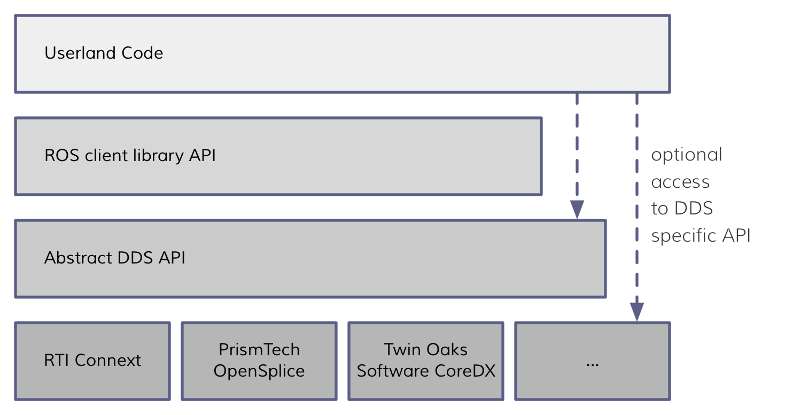
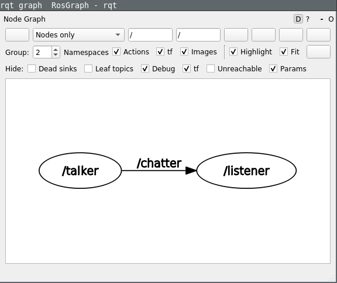

## ECE417: First ROS nodes 


## Getting Linux on Windows 

1. In windows command line type the following command to set the WSL version to 2\.

```shell
wsl --set-default-version 2
```

2. List all the linux distributions available online for install through wsl

```shell
wsl --list --online
```

3. We will install 2022 version of Ubuntu 22.04

```shell
wsl --install -d Ubuntu-22.04
```

4. Make sure it is wsl2 by typing 

```shell
wsl --set-default-version 2 -d Ubuntu-22.04
```

5. Start Ubuntu by typing

```shell
wsl -d Ubuntu-22.04
```

   

## Understanding Data Distribution Service and Discovery 



We are using [Eclipse Cyclone DDS 0.7.0](https://github.com/eclipse-cyclonedds/cyclonedds/tree/master?tab=readme-ov-file#run-time-configuration) for DDS with description of options [here](https://github.com/eclipse-cyclonedds/cyclonedds/blob/master/docs/manual/options.md).

When you are deploying robots, it is better for them to be together on the same subnetwork. DDS can find robots using “simple discovery” when they are on the same subnetwork. Since our robot and laptop are on a separate subnetwork.

[Subnetwork](https://en.wikipedia.org/wiki/Subnet) : A **subnetwork** or **subnet** is a logical subdivision of an IP network. 

```shell
laptop:~/ece417$ ifconfig wlan0
wlan0: flags=4163<UP,BROADCAST,RUNNING,MULTICAST>  mtu 1500
   	 inet 141.114.195.160  netmask 255.255.248.0  broadcast 141.114.199.255
   	 inet6 fe80::f67:d239:daf9:bdf6  prefixlen 64  scopeid 0x20<link>
   	 ether 20:0d:b0:4d:40:b5  txqueuelen 1000  (Ethernet)
   	 RX packets 980  bytes 1106777 (1.1 MB)
   	 RX errors 0  dropped 0  overruns 0  frame 0
   	 TX packets 521  bytes 63464 (63.4 KB)
   	 TX errors 0  dropped 0 overruns 0  carrier 0  collisions 0
```

A IPv4 subnet is determined by netmask which is a 32-bit binary mask over 32-bit IP address. The masked bits are fixed, the unmasked bits form the range of IP addresses in the subnet. For example, netmask for tempest Wi-Fi is 255.255.248.0 which allows for masking for all bits in IP address except the last 11 bits. All IP addresses in the range 141.114.192-200.0-256 are in the same subnet as 141.114.195.160.

## Creating ROS talker listener between jetbot and laptop 

##### 0\. Installing the ROS environment

Before following these instructions, you need to install ROS on your laptop on WSL by following the instructions here:   
[https://docs.ros.org/en/humble/Installation/Ubuntu-Install-Debians.html](https://docs.ros.org/en/humble/Installation/Ubuntu-Install-Debians.html) 

1. ##### Source the ROS environment 

ROS allows you to talk between process. A lot of talking between processes is governed by environment variables. In linux you can see all the environment variables and their values by running 

```shell
laptop:~/ece417$ printenv
```

The problem with printenv is that it prints all environment variables, and there are a lot of them. Linux allows you to filter out a command output by using \`| grep \<filterwords\>\`. We want to see environment variables that contain the word ROS

```shell
laptop:~/ece417$ printenv | grep ROS 
laptop:~/ece417$
```

By default, there is no environment variable regarding ROS. We can source environment files that initialize ROS related environment variables.

```shell
laptop:~/ece417$ source /opt/ros/humble/setup.bash
```

Now check environment variables with the word ROS again, you should see the following. 

```shell
laptop:~/ece417$ printenv | grep ROS
ROS_VERSION=2 
ROS_PYTHON_VERSION=3
ROS_LOCALHOST_ONLY=0
ROS_DISTRO=humble
```

Each environment variable can be modified, and it communicates with all the processes that you will run later on. For example, you can access environment variables inside python as:

```shell
laptop:~/ece417$ python3 -c 'import os; print(os.getenv("ROS_DISTRO"))' 
humble
```

You have to run source /opt/ros/humble/setup.bash in every terminal once before you use any ros command. You can also add it your ~/.bashrc which contains all the commands that are run at the beginning of every shell session. 

2. ##### Run your first ROS node 

Ros nodes are run using \`ros2 run\` command. It takes two arguments, first is the ROS package name. And second is the executable in the package, in the format \`ros2 run \<packagename\> \<executable\>\`.

```shell
laptop:~/ece417$ ros2 run demo_nodes_py listener
```

Here we run the listener executable from the demo\_nodes\_py package. Let it run in this terminal. Open a new terminal for the next steps.

3. ##### Inspect what nodes are running. 

Open a new terminal and run source /opt/ros/humble/setup.bash again, unless you have added it your  ~/.bashrc . You can list all the running nodes with 

```shell
laptop:~/ece417$ ros2 node list
/listener
```

Here /listener is the node name. All names in ROS can form a hierarchy which starts with a forward slash \`/\`. Valid node names can be \`/listeners/student1\`

4. ##### Run the talker node 

Run the talker node in the package name demo\_nodes\_py using the same template as “Run your first node section.”

```shell
laptop:~/ece417$ # What command should you run to a node talker in package demo_nodes_py
[INFO] [1695169878.688667829] [talker]: Publishing: "Hello World: 0"
[INFO] [1695169879.668149723] [talker]: Publishing: "Hello World: 1"
[INFO] [1695169880.668166943] [talker]: Publishing: "Hello World: 2"
[INFO] [1695169881.668083244] [talker]: Publishing: "Hello World: 3
```

Switch to the listener terminal and you should see the listener receiving the messages.

```shell
laptop:~/ece417$ ros2 run demo_nodes_py listener
[INFO] [1695169971.080665762] [listener]: I heard: [Hello World: 0]
[INFO] [1695169972.049128144] [listener]: I heard: [Hello World: 1]
[INFO] [1695169973.048824633] [listener]: I heard: [Hello World: 2]
[INFO] [1695169974.049025512] [listener]: I heard: [Hello World: 3]
[INFO] [1695169975.048981828] [listener]: I heard: [Hello World: 4]
[INFO] [1695169976.049040151] [listener]: I heard: [Hello World: 5]
[INFO] [1695169977.049155199] [listener]: I heard: [Hello World: 6]
```

Let the two terminals talk to each other while we inspect what is going on in a new terminal.

5. ##### More introspection 

Source the ROS environment in the new terminal. What nodes are running. List the nodes that are running from “Inspect what nodes are running section.”

```shell
laptop:~/ece417$ # What command sources the environment variables and you have to run everytime
laptop:~/ece417$ # What command lists all the running nodes
/listener
/talker
```

You can also visualize a graph of all the nodes using 

```shell
laptop:~/ece417$ rqt_graph
```



Sometimes you might have to stop and start the ros2 daemon to make this work.

```shell
laptop:~/ece417$ ros2 daemon stop 
laptop:~/ece417$ ros2 daemon start
```

6. ##### List all the topic 

Similar to listing all the nodes, you can also list all the topics (metaphors: telephone line/channels/information pipelines between nodes).

```shell
laptop:~/ece417$ ros2 topic list
/chatter /parameter_events /rosout
```

Here /chatter is the name of the topic on which /talker and /listener are chatting. You can get more information about the topic using ros2 topic info

```shell
laptop:~/ece417$ ros2 topic info /chatter Type: std\_msgs/msg/String Publisher count: 1 Subscription count: 1
```

You can see what else \`ros2 topic\` has to offer by asking for help

```shell

laptop:~/ece417$ ros2 topic -h
usage: ros2 topic [-h] [--include-hidden-topics]
              	Call `ros2 topic <command> -h` for more detailed usage. ...

Various topic related sub-commands

optional arguments:
  -h, --help        	show this help message and exit
  --include-hidden-topics
                    	Consider hidden topics as well

Commands:
  bw 	Display bandwidth used by topic
  delay  Display delay of topic from timestamp in header
  echo   Output messages from a topic
  find   Output a list of available topics of a given type
  hz 	Print the average publishing rate to screen
  info   Print information about a topic
  list   Output a list of available topics
  pub	Publish a message to a topic
  type   Print a topic's type
```

Try out a few of these

```shell
laptop:~/ece417$ ros2 topic hz /chatter
average rate: 1.000     	min: 1.000s max: 1.000s std dev: 0.00025s window: 2 
```

```shell
laptop:~/ece417$ ros2 topic echo /chatter
data: 'Hello World: 496' 
---
data: 'Hello World: 497' 
---
data: 'Hello World: 417'
```

```shell
laptop:~/ece417$ ros2 topic bw /chatter
Subscribed to [/chatter]
35 B/s from 2 messages
    	Message size mean: 28 B min: 28 B max: 28 B
32 B/s from 3 messages
    	Message size mean: 28 B min: 28 B max: 28 B
```

7. ##### Configure Wireguard VPN tunnel 

Configuring Wireguard VPN tunnel between the laptop and the robot has the following advantages

1. Sends encrypted messages between the laptop and the robot, making the communication private and secure  
2. One of the peers (the robot or the laptop) must have a public IP address. Once a connection is established, both the robot and the laptop can communicate, even if one is behind a NAT router.  
3. Built-in roaming: Once the connection is established all peers including the initial peer that had a public IP address can change their IP addresses.

“WireGuard associates tunnel IP addresses with public keys and remote endpoints. When the interface sends a packet to a peer, it does the following:

1. This packet is meant for 192.168.30.8. Which peer is that? Let me look... Okay, it's for peer `ABCDEFGH`. (Or if it's not for any configured peer, drop the packet.)  
2. Encrypt entire IP packet using peer `ABCDEFGH`'s public key.  
3. What is the remote endpoint of peer `ABCDEFGH`? Let me look... Okay, the endpoint is UDP port 53133 on host 216.58.211.110.  
4. Send encrypted bytes from step 2 over the Internet to 216.58.211.110:53133 using UDP.

When the interface receives a packet, this happens:

1. I just got a packet from UDP port 7361 on host 98.139.183.24. Let's decrypt it\!  
2. It decrypted and authenticated properly for peer `LMNOPQRS`. Okay, let's remember that peer `LMNOPQRS`'s most recent Internet endpoint is 98.139.183.24:7361 using UDP.  
3. Once decrypted, the plain-text packet is from 192.168.43.89. Is peer `LMNOPQRS` allowed to be sending us packets as 192.168.43.89?  
4. If so, accept the packet on the interface. If not, drop it.”[^1]

Please [watch this excellent video](https://www.youtube.com/watch?v=YEBfamv-_do) for public/private key cryptography.

Install wireguard on both laptop and jetbot. Also create a directory \~/.config/wg/

```shell
laptop:~/ece417$ sudo apt update
laptop:~/ece417$ sudo apt install wireguard
```

Same on the jetbot:

```shell
jetbot@nano-4gb-jp45:~$ sudo apt update 
jetbot@nano-4gb-jp45:~$ sudo apt install wireguard
```

Create wireguard private keys for both laptop and jetbot.

```shell
laptop:~/ece417$ mkdir -p ~/.config/wg
laptop:~/ece417$ cd ~/.config/wg
laptop:~/.config/wg$ wg genkey > private.key
laptop:~/.config/wg$ chmod 0660 private.key
laptop:~/.config/wg$ cat private.key
<this will print laptop_wireguard_privatekey>
```

Create wireguard private keys on jetbot

```shell
jetbot@nano-4gb-jp45:~/ece417$ mkdir -p ~/.config/wg
jetbot@nano-4gb-jp45:~/ece417$ cd ~/.config/wg
jetbot@nano-4gb-jp45:~/.config/wg$ wg genkey > private.key
jetbot@nano-4gb-jp45:~/.config/wg$ chmod 0660 private.key
jetbot@nano-4gb-jp45:~/.config/wg$ cat private.key
<this will print jetbot_wireguard_privatekey>
```

Do not repeat the above commands. You do not want to generate new private
keys once they are generated.


To get jetbot’s public key, run the following on the jetbot in the `~/.config/wg` directory

```shell
jetbot@nano-4gb-jp45:~/.config/wg$ wg pubkey < private.key
<this will print jetbot_wireguard_publickey>
```

Replace \<jetbot\_wireguard\_publickey\> with the output of the above command.  
Replace \<jetbot\_ip\_address\> with the IP address of jetbot as seen on the OLED display.

Create a file `~/.config/wg/wg0.conf` on the laptop with the following contents:

:::{code} ini
:filename: laptop:~/.config/wg/wg0.conf
[Interface]
Address = 10.0.0.3/24
PrivateKey = <laptop_wireguard_privatekey>


[Peer]
PublicKey = <jetbot_wireguard_publickey>
AllowedIPs = 10.0.0.2/32
PersistentKeepalive = 25
Endpoint = <jetbot_ip_addres>:51820
:::

Create a symmetrical file on the jetbot but with minor differences:

```shell
laptop:~/.config/wg$ wg pubkey < private.key
<this will print laptop_wireguard_publickey>
```

Repeat the same on the jetbot.

:::{code} ini
:filename: jetbot@nano-4gb-jp45:~/.config/wg/wg0.conf

[Interface]
Address = 10.0.0.2/24
PrivateKey = <jetbot_wireguard_privatekey>
ListenPort = 51820

[Peer]
PublicKey = <laptop_wireguard_publickey>
AllowedIPs = 10.0.0.3/32
PersistentKeepalive = 25
:::

Note the additional `ListenPort =` line and the absence of the `Endpoint =` line.  
Explanations:

1. Interface\>Address: A new set of IP addresses that will be assigned to wireguard to deal with. The first number is the new IP address this computer will assigned in the wireguard VPN.  
2. Interface\>ListenPort: Listen for connections on this port  
3. Peer\>AllowedIPs: This set of IP addresses are allowed as this peer.  
4. Peer\>EndPoint: This peer has a ‘ListenPort’ at this particular IP address and port. Try connecting there first.  
5. Peer\>PersisitentKeepAlive: Keep sending fake data every 25s for the connection to be reset due to the robot being behind a NAT router.

Bring up the wireguard on the laptop

```shell
laptop:~/.config/wg$ chmod 0660 wg0.conf
laptop:~/.config/wg$ sudo wg-quick up ./wg0.conf
[#] ip link add wg0 type wireguard
[#] wg setconf wg0 /dev/fd/63
[#] ip -4 address add 10.0.0.3/24 dev wg0
[#] ip link set mtu 1420 up dev wg0
```

You should see an additional interface in the output of ifconfig command

```shell
laptop:~/.config/wg$ ifconfig
…
wg0: flags=209<UP,POINTOPOINT,RUNNING,NOARP>  mtu 1420
    	inet 10.0.0.3  netmask 255.255.255.0  destination 10.0.0.3
    	unspec 00-00-00-00-00-00-00-00-00-00-00-00-00-00-00-00  txqueuelen 1000  (UNSPEC)
    	RX packets 1  bytes 92 (92.0 B)
    	RX errors 0  dropped 0  overruns 0  frame 0
    	TX packets 3  bytes 212 (212.0 B)
    	TX errors 0  dropped 0 overruns 0  carrier 0  collisions 0
```

Check the status of wireguard with wg show

```shell
laptop:~/.config/wg$ sudo wg show
interface: wg0
  public key: tQ39QO5530z2tv73dzVQXVfFbKEEKn1l/lpFXK4aW3w=
  private key: (hidden)
  listening port: 51820

peer: G4Y7wwnJhrQUqafFC7PXp1C1NqADQNcp0dwRBYrp0DI=
  endpoint: 141.114.195.160:51820
  allowed ips: 10.0.0.2/32
  persistent keepalive: every 25 seconds
```

Repeat the same commands on jetbot

```
jetbot@nano-4gb-jp45:~/.config/wg$ chmod 0660 wg0.conf
jetbot@nano-4gb-jp45:~/.config/wg$ sudo wg-quick up ./wg0.conf
[#] ip link add wg0 type wireguard
[#] wg setconf wg0 /dev/fd/63
[#] ip -4 address add 10.0.0.2/24 dev wg0
[#] ip link set mtu 1420 up dev wg0
jetbot@nano-4gb-jp45:~/.config/wg$ sudo wg show
interface: wg0
  public key: G4Y7wwnJhrQUqafFC7PXp1C1NqADQNcp0dwRBYrp0DI=
  private key: (hidden)
  listening port: 51820

peer: tQ39QO5530z2tv73dzVQXVfFbKEEKn1l/lpFXK4aW3w=
  endpoint: 130.111.219.79:51820
  allowed ips: 10.0.0.3/32
  latest handshake: 1 minute, 17 seconds ago
  transfer: 212 B received, 156 B sent
  persistent keepalive: every 25 seconds
```

Make sure the public key of the laptop is jetbot's peer and vice-versa. If
your wireguard is not working, it either of the two things (1) the public
keys do not match, or (2) the endpoint is not correct.

Going forward, the only thing you might need to change is the endpoint if the
IP address of If you make changes to `wg0.conf`, you will need to restart wireguard using
`sudo wg-quick down wg0` followed by `sudo wg-quick up ./wg0.conf`.

If everything went right, then you should be able to access jetbot via 10.0.0.2 and laptop via 10.0.0.3. From the laptop try 

```shell
laptop:~/.config/wg$ ping 10.0.0.2
PING 10.0.0.2 (10.0.0.2) 56(84) bytes of data.
64 bytes from 10.0.0.2: icmp_seq=1 ttl=64 time=2.06 ms
64 bytes from 10.0.0.2: icmp_seq=2 ttl=64 time=2.10 ms
```

From the jetbot try

```shell
laptop:~/.config/wg$ ping 10.0.0.3
PING 10.0.0.2 (10.0.0.2) 56(84) bytes of data.
64 bytes from 10.0.0.3: icmp_seq=1 ttl=64 time=2.06 ms
64 bytes from 10.0.0.3: icmp_seq=2 ttl=64 time=2.10 ms
```

You can even ssh to jetbot using 10.0.0.2

```shell
laptop:~/.config/wg$ ssh jetbot@10.0.0.2
```

You can also open jupyter lab running on jetbot from the new IP address [http://10.0.0.2:8888](http://10.0.0.2:8888)

Another check to make sure UDP packets from jetbot can reach the laptop run netcat in UDP listen mode on the port 7410

```shell
laptop:~/.config/wg$ netcat -u -l 10.0.0.3 7410
```

On the jetbot run netcat in UDP send mode and then type hello and press enter

```shell
jetbot@nano-4gb-jp45:~$ netcat -u 10.0.0.3 7410
hello
```

You should see hello on the laptop end. If this does not work, then you have some firewall issues.

Make this wireguard configuration permanent so that this happens every time the robot boots up.

```
jetbot@nano-4gb-jp45:~/.config/wg$ sudo cp wg0.conf /etc/wireguard/wg0.conf
jetbot@nano-4gb-jp45:~/.config/wg$ sudo systemctl enable wg-quick@wg0.service
```

Repeat the same on the laptop, if you prefer. I prefer to manually start wg on my laptop because it contains the IP address of the jetbot as Endpoint which might change.

8. ##### Configuring Initial Peers list 

We are going to switch to Eclipse Cyclone DDS 0.7.0 instead of using eProsima Fast DDS. The closest documentation is [here](https://cyclonedds.io/docs/cyclonedds/0.8.2/). CycloneDDS is already installed on the jetbot, you have to install it on the laptop.

```shell
laptop:~/ece417$ sudo apt update
laptop:~/ece417$ sudo apt install ros-humble-rmw-cyclonedds-cpp
```

To tell ROS that we are going to use a different Ros MiddleWare, use the RMW\_IMPLEMENTATION environment variable,

```shell
laptop:~/ece417$ export RMW_IMPLEMENTATION=rmw_cyclonedds_cpp
```

Check all the ROS related environment variables we have learned so far,

```shell
laptop:~/ece417$ printenv | grep -E "ROS|RMW_IMPLEMENTATION"
ROS_VERSION=2
ROS_PYTHON_VERSION=3
ROS_LOCALHOST_ONLY=0
ROS_DISTRO=humble
RMW_IMPLEMENTATION=rmw_cyclonedds_cpp
```

We have to type these commands a lot, so let’s add them to our setup.bash and create an alias for the `printenv | grep` command. Create setup.bash with following lines:

:::{code} bash
:filename: setup.bash
source /opt/ros/humble/setup.bash
export RMW_IMPLEMENTATION=rmw_cyclonedds_cpp
alias rosenv='printenv | grep -E "ROS|RMW_IMPLEMENTATION"'
:::

```shell
laptop:~/ece417$ source setup.bash
laptop:~/ece417$ rosenv
ROS_VERSION=2
ROS_PYTHON_VERSION=3
ROS_LOCALHOST_ONLY=0
ROS_DISTRO=humble
RMW_IMPLEMENTATION=rmw_cyclonedds_cpp
```

Wireguard does not support multicast, so we have to setup initial peer list on the CycloneDDS configuration file. Create a file called `cyclonedds.xml`

:::{code} xml
:filename: laptop:~/ece417/cyclonedds.xml
<?xml version="1.0" encoding="UTF-8" ?>
<CycloneDDS xmlns="https://cdds.io/config" 
    xmlns:xsi="http://www.w3.org/2001/XMLSchema-instance" 
    xsi:schemaLocation="https://cdds.io/config
                        https://raw.githubusercontent.com/eclipse-cyclonedds/cyclonedds/master/etc/cyclonedds.xsd">
	<Domain id="any">
  	<Discovery>
    	<Peers>
      	<!--Peer address="10.0.0.1" ></Peer-->
      	<Peer address="10.0.0.2" ></Peer>
      	<Peer address="10.0.0.3" ></Peer>
    	</Peers>
  	</Discovery>
    	<General>
        	 <Interfaces><NetworkInterface name="wg0"/></Interfaces>
    	</General>
    	<Tracing>
        	<Verbosity>config</Verbosity>
        	<OutputFile>${HOME}/.ros/cyclonedds.log.${CYCLONEDDS_PID}</OutputFile>
    	</Tracing>
	</Domain>
</CycloneDDS>
:::

We have overridden the Peer list, NetworkInterface and verbosity level for debugging purposes. Tell rmw\_cyclconedds\_cpp middleware about the location of this configuration file using another environment variable

```shell
laptop:~/ece417$ export CYCLONEDDS_URI="file://$(pwd)/cyclonedds.xml"
```

Add this to the setup.bash as well


:::{code} bash
:filename: setup.bash
source /opt/ros/humble/setup.bash
export RMW_IMPLEMENTATION=rmw_cyclonedds_cpp
alias rosenv='printenv | grep -E "ROS|RMW_IMPLEMENTATION"'
export CYCLONEDDS_URI="file://$(pwd)/cyclonedds.xml"
alias rosenv='printenv | grep -E "ROS|RMW_IMPLEMENTATION|CYCLONEDDS_URI"'
:::

Copy the setup.bash and cyclonedds.xml files to the jetbot and create a docker container using the ros image that we pulled earlier.

```shell
laptop:~/ece417$ scp setup.bash cyclonedds.xml jetbot@10.0.0.2:~/ece417
```


```shell
jetbot@nano-4gb-jp45:~/ece417$ sudo docker container rm ros-humble
jetbot@nano-4gb-jp45:~/ece417$ sudo docker run --name ros-humble --network host -v /home/jetbot:/home/jetbot -v /etc/passwd:/etc/passwd -v /etc/shadow:/etc/shadow -v /etc/group:/etc/group -u $(id -u) --ipc host --privileged --workdir /home/jetbot/ece417 -it dustynv/ros:humble-pytorch-l4t-r32.7.1 bash
sourcing   /opt/ros/humble/install/setup.bash
ROS_DISTRO humble
ROS_ROOT   /opt/ros/humble
```
On Jetbot the location of ros setup.bash is different. It is  `/opt/ros/humble/install/setup.bash` instead of `/opt/ros/humble/setup.bash`. Change that in the setup.bash

:::{code} bash
:filename: jetbot:~/ece417/setup.bash
source /opt/ros/humble/install/setup.bash
export RMW_IMPLEMENTATION=rmw_cyclonedds_cpp
alias rosenv='printenv | grep -E "ROS|RMW_IMPLEMENTATION"'
export CYCLONEDDS_URI="file://$(pwd)/cyclonedds.xml"
alias rosenv='printenv | grep -E "ROS|RMW_IMPLEMENTATION|CYCLONEDDS_URI"'
:::

Now you should be able to source it.

```
jetbot@nano-4gb-jp45:~/ece417$ source setup.bash
```

Now ros node talker and listener between jetbot and the laptop must be able to talk to each other.

```shell
laptop:~/ece417$ ros2 run demo_nodes_py listener
```

```shell
jetbot@nano-4gb-jp45:~/ece417$ ros2 run demo_nodes_py talker
```

[^1]:  https://www.wireguard.com/

